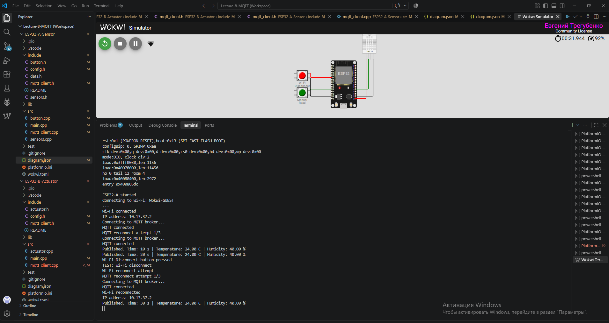
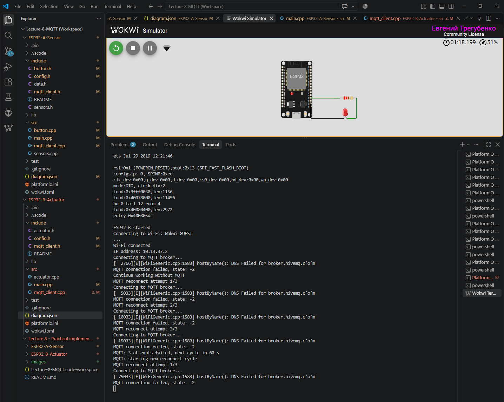

# Домашнє завдання 4
## Практичне застосування MQTT. Два пристрої, одна мережа

### 🎯 Мета роботи

Побудувати IoT-систему з двох незалежних ESP32, які обмінюються даними через MQTT-брокер.

У проєкті реалізовано:

- сенсорний вузол **ESP32-A** з DHT22 та кнопкою;
- виконавчий вузол **ESP32-B** зі світлодіодом;
- обмін даними через публічний MQTT-брокер;
- ієрархію MQTT-топіків;
- підписку ESP32-B на температуру з QoS 1;
- автоматичне відновлення MQTT-з'єднання;
- керування LED залежно від температури;
- команду `manual_read`;
- контроль MQTT-повідомлень через MQTT-клієнт.

Пристрої не мають прямого з'єднання між собою:

```text
ESP32-A  ─────►  MQTT Broker  ─────►  ESP32-B
 Sensor                                Actuator
```

ESP32-A лише публікує дані, а ESP32-B отримує необхідні повідомлення через підписки.

---

# 1. Два окремі Wokwi-проєкти

Проєкт складається з двох незалежних пристроїв:

```text
Lecture 8 - Practical implementation of MQTT/
│
├── ESP32-A-Sensor/
│   ├── include/
│   ├── src/
│   ├── diagram.json
│   ├── platformio.ini
│   └── wokwi.toml
│
├── ESP32-B-Actuator/
│   ├── include/
│   ├── src/
│   ├── diagram.json
│   ├── platformio.ini
│   └── wokwi.toml
│
├── images/
└── README.md
```

## ESP32-A — Sensor

До ESP32-A підключено:

- DHT22;
- кнопку `Manual Read`.

Підключення:

| Компонент | GPIO |
|---|---:|
| DHT22 DATA | GPIO4 |
| Manual Read | GPIO14 |

Кнопка працює в режимі:

```cpp
INPUT_PULLUP
```

### Публікація даних DHT22

ESP32-A кожні **10 секунд** зчитує температуру та вологість.

Дані публікуються окремо:

```text
iot-course/Tregubenko/sensors/temperature
iot-course/Tregubenko/sensors/humidity
```

Приклад роботи:

```text
Published. Time: 10 s | Temperature: 35.20 C | Humidity: 40.00 %
Published. Time: 20 s | Temperature: 35.20 C | Humidity: 40.00 %
Published. Time: 30 s | Temperature: 35.20 C | Humidity: 40.00 %
```

Періодичність реалізована через `millis()` без блокування основного циклу програми.

### Команда Manual Read

При натисканні кнопки ESP32-A публікує:

```text
Topic:
iot-course/Tregubenko/commands

Payload:
manual_read
```

У Serial Monitor:

```text
Button pressed
Command published: manual_read
```

Для кнопки реалізовано програмний debounce.

---

## ESP32-B — Actuator

До ESP32-B підключено LED через резистор 220 Ом.

| Компонент | GPIO |
|---|---:|
| LED | GPIO2 |

ESP32-B підписується на:

```text
iot-course/Tregubenko/sensors/temperature
iot-course/Tregubenko/commands
```

Отримані MQTT-повідомлення обробляються callback-функцією.

---

## Керування LED за температурою

Реалізована логіка:

```text
Temperature > 26 °C → LED ON
Temperature < 20 °C → LED OFF
```

Між порогами стан LED не змінюється:

```text
20...26 °C → попередній стан LED
```

Приклад:

```text
Temperature received: 35.20 C
LED ON
```

При зниженні температури:

```text
Temperature received: 10.80 C
LED OFF
```

Перевірка роботи двох ESP32:


---

## Перевірка гістерезису

При температурі всередині діапазону `20...26 °C` LED зберігає попередній стан.

Наприклад:

```text
Temperature received: 24.60 C
```

При цьому команда `LED ON` або `LED OFF` не виконується.


---

## Обробка manual_read

ESP32-B підписаний на:

```text
iot-course/Tregubenko/commands
```

При отриманні:

```text
manual_read
```

у Serial Monitor виводиться:

```text
Manual trigger received
```

та LED блимає **три рази**.

Мигання реалізовано неблокуючим способом через `millis()`, без використання `delay()`.

Завдяки цьому під час мигання продовжується виконання:

```cpp
mqttClient.loop();
```

Після завершення трьох спалахів LED повертається до стану, визначеного температурою.

---

# 2. Публічний MQTT-брокер

Для обох ESP32 використовується публічний MQTT-брокер:

```text
broker.hivemq.com
```

Порт:

```text
1883
```

Кожен пристрій має окремий MQTT Client ID:

```text
ESP32-Tregubenko-A
ESP32-Tregubenko-B
```

Це дозволяє двом пристроям одночасно працювати з одним брокером без конфлікту MQTT Client ID.

---

# 3. Відновлення MQTT-з'єднання

При втраті MQTT-з'єднання реалізовано автоматичний reconnect.

Параметри:

```text
Інтервал між спробами: 5 секунд
Максимальна кількість спроб: 3
```

Приклад Serial Monitor:

```text
MQTT reconnect attempt 1/3
MQTT reconnected
```


Reconnect реалізовано без блокуючого циклу.

На ESP32-B після успішного reconnect також повторно виконується підписка на MQTT-топіки:

```text
MQTT reconnected
Subscribed to temperature topic, QoS 1
Subscribed to commands topic, QoS 0
```

---

# 4. Ієрархія MQTT-топіків

У проєкті використовується наступна структура:

```text
iot-course/Tregubenko/
│
├── sensors/
│   ├── temperature
│   └── humidity
│
├── actuators/
│   └── led
│
├── commands
│
└── status
```

| MQTT topic | Призначення |
|---|---|
| `iot-course/Tregubenko/sensors/temperature` | Температура DHT22 |
| `iot-course/Tregubenko/sensors/humidity` | Вологість DHT22 |
| `iot-course/Tregubenko/actuators/led` | Стан LED |
| `iot-course/Tregubenko/commands` | Команди між пристроями |
| `iot-course/Tregubenko/status` | Стан ESP32-B |

Для перегляду всіх повідомлень можна підписатися на wildcard-топік:

```text
iot-course/Tregubenko/#
```

---

# 5. QoS 1 для отримання температури

ESP32-B підписується на топік температури з **QoS 1**:

```cpp
mqttClient.subscribe(
    MQTT_TOPIC_TEMPERATURE,
    1
);
```

У Serial Monitor після підключення:

```text
Subscribed to temperature topic, QoS 1
```

Команди підписані з QoS 0:

```text
Subscribed to commands topic, QoS 0
```

---

# 6. Перевірка через MQTT-клієнт

Для перевірки роботи використовувався MQTT WebSocket Client.

Клієнт підписаний на:

```text
iot-course/Tregubenko/#
```

що дозволяє контролювати повідомлення всіх топіків проєкту.


---

## Історія MQTT-повідомлень

На наступному скріншоті одночасно видно:

- ESP32-A;
- ESP32-B;
- MQTT-клієнт;
- повідомлення температури;
- повідомлення вологості;
- зміну стану LED.


---

# Додаткова реалізація

Крім основних вимог домашнього завдання, реалізовано декілька додаткових можливостей.

## Публікація стану LED

При зміні стану LED ESP32-B публікує:

```text
iot-course/Tregubenko/actuators/led
```

Payload:

```text
ON
```

або:

```text
OFF
```

Наприклад:

```text
Temperature received: 35.20 C
LED ON
LED state published: ON

Temperature received: 10.80 C
LED OFF
LED state published: OFF
```

---

## MQTT Status

Для контролю доступності ESP32-B використовується:

```text
iot-course/Tregubenko/status
```

Після успішного підключення ESP32-B публікує:

```text
online
```

Повідомлення публікується з прапорцем `retain`, тому брокер зберігає останній відомий стан пристрою.

---

## Last Will and Testament

При підключенні ESP32-B реєструє MQTT Last Will:

```text
Topic:
iot-course/Tregubenko/status

Payload:
offline

Retain:
true
```

Якщо ESP32-B аварійно втрачає MQTT-з'єднання, брокер автоматично публікує:

```text
offline
```

Після повторного підключення ESP32-B знову публікує:

```text
online
```

Таким чином:

```text
ESP32-B підключений       → online
ESP32-B втратив зв'язок   → offline
ESP32-B підключився знову → online
```


---

# Архітектура системи

```text
                         broker.hivemq.com
                           MQTT Broker
                               ▲   ▲
                               │   │
              ┌────────────────┘   └────────────────┐
              │                                     │
              │ MQTT                           MQTT │
              │                                     │
           ESP32-A                               ESP32-B
            SENSOR                               ACTUATOR
              │                                     │
        ┌─────┴─────┐                               │
        │           │                               │
      DHT22       Button                           LED
        │           │                               │
 temperature    manual_read                     ON / OFF
 humidity

ESP32-A → Broker:
  sensors/temperature
  sensors/humidity
  commands

Broker → ESP32-B:
  sensors/temperature
  commands

ESP32-B → Broker:
  actuators/led
  status
```

ESP32-A не знає про існування ESP32-B.

ESP32-B не звертається безпосередньо до ESP32-A.

Взаємодія між пристроями виконується виключно через MQTT-топіки.

---

# Результат

Виконані основні вимоги домашнього завдання:

- [x] створено два окремі Wokwi-проєкти;
- [x] ESP32-A працює з DHT22 та кнопкою;
- [x] температура та вологість публікуються кожні 10 секунд;
- [x] кнопка публікує команду `manual_read`;
- [x] ESP32-B керує LED залежно від температури;
- [x] LED вмикається при температурі вище 26 °C;
- [x] LED вимикається при температурі нижче 20 °C;
- [x] `manual_read` викликає три спалахи LED;
- [x] у Serial виводиться `Manual trigger received`;
- [x] використовується публічний MQTT-брокер;
- [x] реалізовано reconnect через 5 секунд;
- [x] максимальна кількість reconnect-спроб — 3;
- [x] реалізована ієрархія MQTT-топіків;
- [x] ESP32-B підписується на температуру з QoS 1;
- [x] MQTT-клієнт підписаний на `iot-course/Tregubenko/#`;
- [x] історія MQTT-повідомлень зафіксована на скріншотах.

Додатково реалізовано:

- [x] гістерезис керування LED;
- [x] неблокуюче мигання LED;
- [x] публікація стану LED через MQTT;
- [x] повторна підписка на топіки після reconnect;
- [x] MQTT status `online/offline`;
- [x] retained status;
- [x] Last Will and Testament.

---

# Виправлення після перевірки домашнього завдання

Після перевірки домашнього завдання було внесено додаткові зміни до логіки ініціалізації та автоматичного відновлення мережевих з'єднань **ESP32-A** та **ESP32-B**.

Основні зміни:

- додано автоматичне відновлення Wi-Fi-з'єднання;
- конфігурацію MQTT-клієнта винесено в окрему функцію `initMQTT()`;
- змінено алгоритм MQTT reconnect після трьох невдалих спроб;
- після паузи автоматично запускається новий цикл MQTT reconnect;
- усунено дублювання процедури MQTT-підключення в ESP32-B;
- виконано окремі тести відновлення Wi-Fi та MQTT-з'єднання у Wokwi.

---

## 1. Автоматичне відновлення Wi-Fi-з'єднання

Для **ESP32-A** та **ESP32-B** додано окрему неблокуючу функцію обслуговування Wi-Fi-з'єднання:

```cpp
wifiLoop();
```

Функція викликається з основного `loop()` перед обслуговуванням MQTT:

```cpp
void loop() {

    wifiLoop(); // Обслуговування Wi-Fi-з'єднання

    mqttLoop(); // Обслуговування MQTT-з'єднання

    // ...
}
```

Якщо Wi-Fi-з'єднання втрачено:

- основний цикл програми продовжує виконуватися;
- кожні **5 секунд** виконується спроба відновлення Wi-Fi;
- використовується `WiFi.reconnect()`;
- після фактичного відновлення з'єднання виводиться повідомлення `Wi-Fi reconnected`;
- після відновлення Wi-Fi механізм MQTT reconnect автоматично відновлює MQTT-з'єднання.

Параметр інтервалу reconnect винесено в `config.h`:

```cpp
#define WIFI_RETRY_DELAY 5000
```

### Тестове відключення Wi-Fi

Для перевірки механізму Wi-Fi reconnect у **ESP32-A** додано окрему тестову кнопку `Wi-Fi Disconnect`.

Кнопка виконує програмне відключення ESP32 від Wi-Fi:

```cpp
WiFi.disconnect();
```

Після цього `wifiLoop()` автоматично запускає процес відновлення з'єднання.

Приклад Serial Monitor:

```text
Wi-Fi Disconnect button pressed
TEST: Wi-Fi disconnect

Wi-Fi reconnect attempt

MQTT reconnect attempt 1/3
Connecting to MQTT broker...
MQTT connected

Wi-Fi reconnected
IP address: 10.13.37.2
```

Після відновлення Wi-Fi та MQTT ESP32-A продовжує звичайну публікацію даних DHT22:

```text
Published. Time: 50 s | Temperature: 24.00 C | Humidity: 40.00 %
```

### Результат тесту Wi-Fi reconnect



Таким чином перевірено повний сценарій:

```text
Wi-Fi Disconnect
        │
        ▼
Wi-Fi connection lost
        │
        ▼
wifiLoop()
        │
        ▼
WiFi.reconnect()
        │
        ▼
Wi-Fi restored
        │
        ▼
mqttLoop()
        │
        ▼
MQTT reconnect
        │
        ▼
Normal operation
```

Тестова кнопка `Wi-Fi Disconnect` використовується тільки для перевірки механізму відновлення Wi-Fi у Wokwi та не є частиною основної функціональності пристрою.

---

## 2. Ініціалізація MQTT незалежно від стану Wi-Fi

Для **ESP32-A** та **ESP32-B** конфігурацію MQTT-клієнта винесено в окрему функцію:

```cpp
initMQTT();
```

Функція викликається під час `setup()` **до початкової спроби підключення до Wi-Fi**.

Для ESP32-A:

```cpp
initSensors();

initMQTT();

if (!connectWiFi()) {
    // ...
}
```

Для ESP32-B:

```cpp
initActuator();

initMQTT();

if (!connectWiFi()) {
    // ...
}
```

Для обох пристроїв у `initMQTT()` налаштовуються:

- адреса MQTT-брокера;
- порт MQTT-брокера;
- MQTT Keep Alive;
- socket timeout.

Для **ESP32-B** додатково реєструється MQTT callback-функція:

```cpp
mqttClient.setCallback(mqttCallback);
```

ESP32-A не потребує callback-функції, оскільки у поточній реалізації він тільки публікує MQTT-повідомлення.

Завдяки окремій ініціалізації MQTT-клієнт налаштований незалежно від результату початкового підключення до Wi-Fi.

Якщо Wi-Fi був недоступний під час запуску ESP32, але відновився пізніше, пристрій може коректно виконати MQTT-підключення через механізм reconnect.

---

## 3. Повторні цикли MQTT reconnect

У початковій реалізації після трьох невдалих спроб підключення до MQTT-брокера нові спроби більше не виконувалися.

У результаті, якщо MQTT-брокер залишався недоступним більше часу, пристрій не міг самостійно відновити MQTT-з'єднання після відновлення роботи брокера.

Логіку reconnect змінено для **ESP32-A** та **ESP32-B**.

Поточний алгоритм:

```text
MQTT connection lost
        │
        ▼
Reconnect attempt 1/3
        │
      5 s
        ▼
Reconnect attempt 2/3
        │
      5 s
        ▼
Reconnect attempt 3/3
        │
        ▼
Pause 60 s
        │
        ▼
Reset attempts counter
        │
        ▼
Start new reconnect cycle
        │
        ▼
Reconnect attempt 1/3
```

Параметри винесено в `config.h`:

```cpp
#define MQTT_RETRY_DELAY       5000
#define MQTT_MAX_RETRIES       3
#define MQTT_RETRY_CYCLE_DELAY 60000
```

Таким чином:

- між окремими спробами MQTT reconnect — **5 секунд**;
- максимальна кількість спроб в одному циклі — **3**;
- після трьох невдалих спроб — пауза **60 секунд**;
- після паузи лічильник спроб скидається;
- автоматично починається новий цикл із трьох спроб;
- після успішного підключення лічильник спроб скидається.

При вичерпанні трьох спроб:

```text
MQTT: 3 attempts failed, next cycle in 60 s
```

Через 60 секунд:

```text
MQTT: starting new reconnect cycle
MQTT reconnect attempt 1/3
```

Таким чином пристрій не припиняє спроби відновлення MQTT-з'єднання назавжди навіть при тривалій недоступності брокера.

---

## 4. Перевірка MQTT reconnect — ESP32-A

Для перевірки механізму reconnect у `config.h` ESP32-A було тимчасово вказано недоступну адресу MQTT-брокера.

У Serial Monitor отримано:

```text
MQTT reconnect attempt 1/3
Connecting to MQTT broker...
MQTT connection failed, state: -2

MQTT reconnect attempt 2/3
Connecting to MQTT broker...
MQTT connection failed, state: -2

MQTT reconnect attempt 3/3
Connecting to MQTT broker...
MQTT connection failed, state: -2

MQTT: 3 attempts failed, next cycle in 60 s
```

Після паузи:

```text
MQTT: starting new reconnect cycle
MQTT reconnect attempt 1/3
Connecting to MQTT broker...
MQTT connection failed, state: -2
```

### Результат тесту ESP32-A


Тест підтверджує, що після трьох невдалих спроб ESP32-A не припиняє роботу механізму reconnect, а через 60 секунд починає новий цикл.

Після завершення тесту в конфігурації було повернуто робочу адресу брокера:

```cpp
#define MQTT_BROKER "broker.hivemq.com"
```

---

## 5. Перевірка MQTT reconnect — ESP32-B

Аналогічний тест виконано для **ESP32-B**.

Для тестування також було тимчасово вказано недоступну адресу MQTT-брокера.

У Serial Monitor:

```text
MQTT reconnect attempt 1/3
Connecting to MQTT broker...
MQTT connection failed, state: -2

MQTT reconnect attempt 2/3
Connecting to MQTT broker...
MQTT connection failed, state: -2

MQTT reconnect attempt 3/3
Connecting to MQTT broker...
MQTT connection failed, state: -2

MQTT: 3 attempts failed, next cycle in 60 s
```

Після 60-секундної паузи:

```text
MQTT: starting new reconnect cycle

MQTT reconnect attempt 1/3
Connecting to MQTT broker...
MQTT connection failed, state: -2
```

### Результат тесту ESP32-B



Таким чином для ESP32-B також підтверджено роботу повторних циклів MQTT reconnect.

Після завершення тесту повернуто робочу адресу MQTT-брокера:

```cpp
#define MQTT_BROKER "broker.hivemq.com"
```

---

## 6. Усунення дублювання MQTT reconnect у ESP32-B

У початковій реалізації ESP32-B процедура MQTT-підключення частково дублювалася у функціях:

```cpp
connectMQTT();
```

та:

```cpp
mqttLoop();
```

Окремо виконувалися:

- `mqttClient.connect()`;
- налаштування Last Will;
- повторна підписка на топіки;
- публікація статусу `online`.

Після виправлення вся процедура встановлення MQTT-з'єднання зосереджена у функції:

```cpp
connectMQTT();
```

Функція виконує підключення з Last Will:

```text
Topic:
iot-course/Tregubenko/status

Payload:
offline

Retain:
true
```

Після успішного підключення ESP32-B:

1. підписується на:

```text
iot-course/Tregubenko/sensors/temperature
```

з **QoS 1**;

2. підписується на:

```text
iot-course/Tregubenko/commands
```

з **QoS 0**;

3. публікує retained-статус:

```text
online
```

Функція `mqttLoop()` більше не дублює процедуру підключення.

При необхідності reconnect вона викликає:

```cpp
if (connectMQTT()) {

    mqttReconnectAttempts = 0;
    mqttRetryCyclePaused = false;

    return;
}
```

Таким чином одна й та сама функція використовується як для початкового MQTT-підключення, так і для повторного підключення.

Це також гарантує, що після кожного успішного reconnect ESP32-B повторно виконає необхідні MQTT-підписки.

---

## 7. Підсумкова логіка відновлення з'єднань

Після внесених змін відновлення мережевого з'єднання виконується на двох рівнях:

```text
                ESP32-A / ESP32-B
                       │
                       ▼
                Wi-Fi connected?
                  │          │
                 YES         NO
                  │          │
                  │          ▼
                  │     wifiLoop()
                  │          │
                  │     reconnect 5 s
                  │          │
                  └────◄─────┘
                       │
                       ▼
                MQTT connected?
                  │          │
                 YES         NO
                  │          │
                  │          ▼
                  │     mqttLoop()
                  │          │
                  │      attempt 1/3
                  │          │
                  │      attempt 2/3
                  │          │
                  │      attempt 3/3
                  │          │
                  │       pause 60 s
                  │          │
                  │       new cycle
                  │          │
                  └────◄─────┘
                       │
                       ▼
                Normal operation
```

Wi-Fi та MQTT reconnect реалізовані без блокуючих циклів у `loop()`.

Це дозволяє основній логіці пристрою продовжувати роботу під час очікування наступної спроби відновлення з'єднання.

---

## Результат виправлень

Після внесення змін та повторного тестування:

- [x] MQTT-клієнт ESP32-A ініціалізується незалежно від початкового стану Wi-Fi;
- [x] MQTT-клієнт ESP32-B ініціалізується незалежно від початкового стану Wi-Fi;
- [x] ESP32-A автоматично відновлює Wi-Fi-з'єднання;
- [x] ESP32-B автоматично відновлює Wi-Fi-з'єднання;
- [x] інтервал між спробами Wi-Fi reconnect — 5 секунд;
- [x] MQTT reconnect виконується циклами максимум по 3 спроби;
- [x] інтервал між MQTT reconnect-спробами — 5 секунд;
- [x] після 3 невдалих MQTT-спроб виконується пауза 60 секунд;
- [x] після паузи автоматично починається новий цикл MQTT reconnect;
- [x] після успішного reconnect лічильник MQTT-спроб скидається;
- [x] ESP32-B після reconnect повторно підписується на MQTT-топіки;
- [x] ESP32-B зберігає підписку на температуру з QoS 1;
- [x] ESP32-B після reconnect повторно публікує retained-статус `online`;
- [x] для ESP32-B зберігається Last Will `offline`;
- [x] усунено дублювання процедури MQTT-підключення ESP32-B;
- [x] Wi-Fi reconnect перевірено у Wokwi;
- [x] повторні цикли MQTT reconnect перевірено окремо для ESP32-A та ESP32-B.