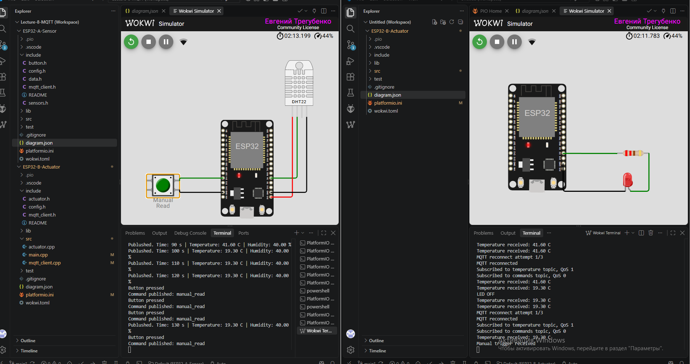
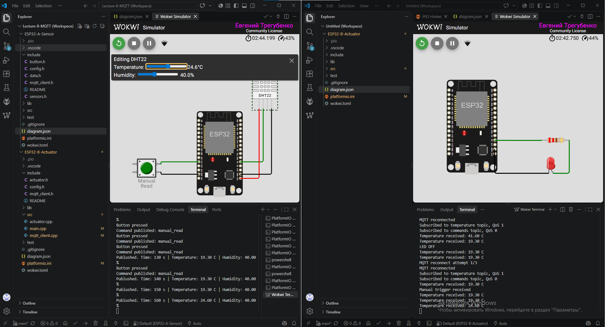
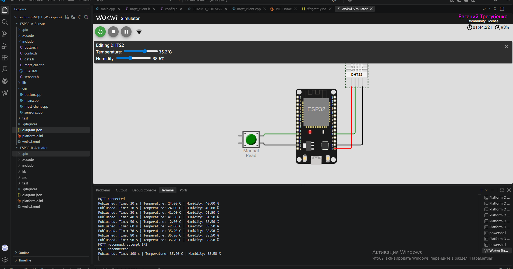
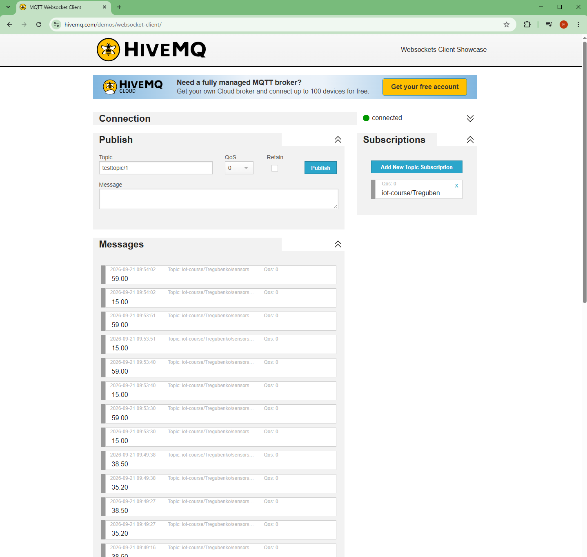
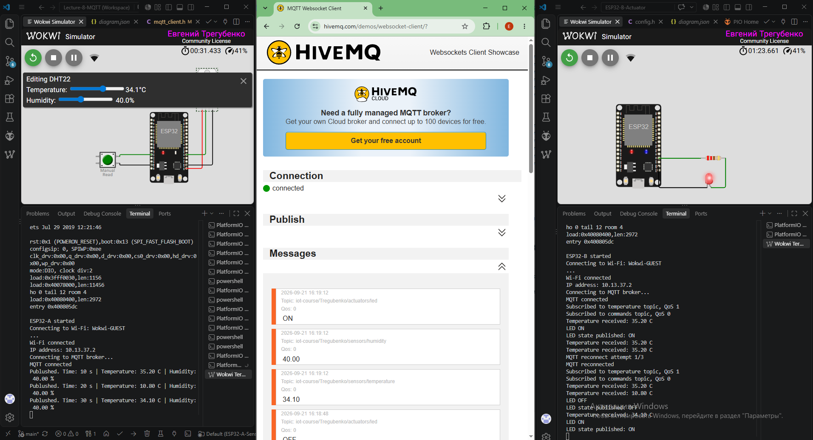
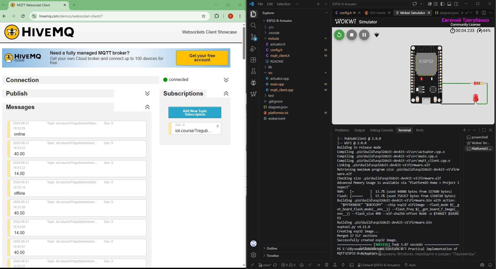

# Домашнє завдання 4
## Практичне застосування MQTT. Два пристрої, одна мережа

### 🎯 Мета роботи

Побудувати IoT-систему з двох незалежних ESP32, які обмінюються даними через MQTT-брокер.

У проєкті реалізовано:

- сенсорний вузол **ESP32-A** з DHT22 та кнопкою;
- виконавчий вузол **ESP32-B** зі світлодіодом;
- обмін даними через публічний MQTT-брокер;
- ієрархію MQTT-топіків;
- підписку ESP32-B на температуру з QoS 1;
- автоматичне відновлення MQTT-з'єднання;
- керування LED залежно від температури;
- команду `manual_read`;
- контроль MQTT-повідомлень через MQTT-клієнт.

Пристрої не мають прямого з'єднання між собою:

```text
ESP32-A  ─────►  MQTT Broker  ─────►  ESP32-B
 Sensor                                Actuator
```

ESP32-A лише публікує дані, а ESP32-B отримує необхідні повідомлення через підписки.

---

# 1. Два окремі Wokwi-проєкти

Проєкт складається з двох незалежних пристроїв:

```text
Lecture 8 - Practical implementation of MQTT/
│
├── ESP32-A-Sensor/
│   ├── include/
│   ├── src/
│   ├── diagram.json
│   ├── platformio.ini
│   └── wokwi.toml
│
├── ESP32-B-Actuator/
│   ├── include/
│   ├── src/
│   ├── diagram.json
│   ├── platformio.ini
│   └── wokwi.toml
│
├── images/
└── README.md
```

## ESP32-A — Sensor

До ESP32-A підключено:

- DHT22;
- кнопку `Manual Read`.

Підключення:

| Компонент | GPIO |
|---|---:|
| DHT22 DATA | GPIO4 |
| Manual Read | GPIO14 |

Кнопка працює в режимі:

```cpp
INPUT_PULLUP
```

### Публікація даних DHT22

ESP32-A кожні **10 секунд** зчитує температуру та вологість.

Дані публікуються окремо:

```text
iot-course/Tregubenko/sensors/temperature
iot-course/Tregubenko/sensors/humidity
```

Приклад роботи:

```text
Published. Time: 10 s | Temperature: 35.20 C | Humidity: 40.00 %
Published. Time: 20 s | Temperature: 35.20 C | Humidity: 40.00 %
Published. Time: 30 s | Temperature: 35.20 C | Humidity: 40.00 %
```

Періодичність реалізована через `millis()` без блокування основного циклу програми.

### Команда Manual Read

При натисканні кнопки ESP32-A публікує:

```text
Topic:
iot-course/Tregubenko/commands

Payload:
manual_read
```

У Serial Monitor:

```text
Button pressed
Command published: manual_read
```

Для кнопки реалізовано програмний debounce.

---

## ESP32-B — Actuator

До ESP32-B підключено LED через резистор 220 Ом.

| Компонент | GPIO |
|---|---:|
| LED | GPIO2 |

ESP32-B підписується на:

```text
iot-course/Tregubenko/sensors/temperature
iot-course/Tregubenko/commands
```

Отримані MQTT-повідомлення обробляються callback-функцією.

---

## Керування LED за температурою

Реалізована логіка:

```text
Temperature > 26 °C → LED ON
Temperature < 20 °C → LED OFF
```

Між порогами стан LED не змінюється:

```text
20...26 °C → попередній стан LED
```

Приклад:

```text
Temperature received: 35.20 C
LED ON
```

При зниженні температури:

```text
Temperature received: 10.80 C
LED OFF
```

Перевірка роботи двох ESP32:



---

## Перевірка гістерезису

При температурі всередині діапазону `20...26 °C` LED зберігає попередній стан.

Наприклад:

```text
Temperature received: 24.60 C
```

При цьому команда `LED ON` або `LED OFF` не виконується.



---

## Обробка manual_read

ESP32-B підписаний на:

```text
iot-course/Tregubenko/commands
```

При отриманні:

```text
manual_read
```

у Serial Monitor виводиться:

```text
Manual trigger received
```

та LED блимає **три рази**.

Мигання реалізовано неблокуючим способом через `millis()`, без використання `delay()`.

Завдяки цьому під час мигання продовжується виконання:

```cpp
mqttClient.loop();
```

Після завершення трьох спалахів LED повертається до стану, визначеного температурою.

---

# 2. Публічний MQTT-брокер

Для обох ESP32 використовується публічний MQTT-брокер:

```text
broker.hivemq.com
```

Порт:

```text
1883
```

Кожен пристрій має окремий MQTT Client ID:

```text
ESP32-Tregubenko-A
ESP32-Tregubenko-B
```

Це дозволяє двом пристроям одночасно працювати з одним брокером без конфлікту MQTT Client ID.

---

# 3. Відновлення MQTT-з'єднання

При втраті MQTT-з'єднання реалізовано автоматичний reconnect.

Параметри:

```text
Інтервал між спробами: 5 секунд
Максимальна кількість спроб: 3
```

Приклад Serial Monitor:

```text
MQTT reconnect attempt 1/3
MQTT reconnected
```



Reconnect реалізовано без блокуючого циклу.

На ESP32-B після успішного reconnect також повторно виконується підписка на MQTT-топіки:

```text
MQTT reconnected
Subscribed to temperature topic, QoS 1
Subscribed to commands topic, QoS 0
```

---

# 4. Ієрархія MQTT-топіків

У проєкті використовується наступна структура:

```text
iot-course/Tregubenko/
│
├── sensors/
│   ├── temperature
│   └── humidity
│
├── actuators/
│   └── led
│
├── commands
│
└── status
```

| MQTT topic | Призначення |
|---|---|
| `iot-course/Tregubenko/sensors/temperature` | Температура DHT22 |
| `iot-course/Tregubenko/sensors/humidity` | Вологість DHT22 |
| `iot-course/Tregubenko/actuators/led` | Стан LED |
| `iot-course/Tregubenko/commands` | Команди між пристроями |
| `iot-course/Tregubenko/status` | Стан ESP32-B |

Для перегляду всіх повідомлень можна підписатися на wildcard-топік:

```text
iot-course/Tregubenko/#
```

---

# 5. QoS 1 для отримання температури

ESP32-B підписується на топік температури з **QoS 1**:

```cpp
mqttClient.subscribe(
    MQTT_TOPIC_TEMPERATURE,
    1
);
```

У Serial Monitor після підключення:

```text
Subscribed to temperature topic, QoS 1
```

Команди підписані з QoS 0:

```text
Subscribed to commands topic, QoS 0
```

---

# 6. Перевірка через MQTT-клієнт

Для перевірки роботи використовувався MQTT WebSocket Client.

Клієнт підписаний на:

```text
iot-course/Tregubenko/#
```

що дозволяє контролювати повідомлення всіх топіків проєкту.



---

## Історія MQTT-повідомлень

На наступному скріншоті одночасно видно:

- ESP32-A;
- ESP32-B;
- MQTT-клієнт;
- повідомлення температури;
- повідомлення вологості;
- зміну стану LED.



---

# Додаткова реалізація

Крім основних вимог домашнього завдання, реалізовано декілька додаткових можливостей.

## Публікація стану LED

При зміні стану LED ESP32-B публікує:

```text
iot-course/Tregubenko/actuators/led
```

Payload:

```text
ON
```

або:

```text
OFF
```

Наприклад:

```text
Temperature received: 35.20 C
LED ON
LED state published: ON

Temperature received: 10.80 C
LED OFF
LED state published: OFF
```

---

## MQTT Status

Для контролю доступності ESP32-B використовується:

```text
iot-course/Tregubenko/status
```

Після успішного підключення ESP32-B публікує:

```text
online
```

Повідомлення публікується з прапорцем `retain`, тому брокер зберігає останній відомий стан пристрою.

---

## Last Will and Testament

При підключенні ESP32-B реєструє MQTT Last Will:

```text
Topic:
iot-course/Tregubenko/status

Payload:
offline

Retain:
true
```

Якщо ESP32-B аварійно втрачає MQTT-з'єднання, брокер автоматично публікує:

```text
offline
```

Після повторного підключення ESP32-B знову публікує:

```text
online
```

Таким чином:

```text
ESP32-B підключений       → online
ESP32-B втратив зв'язок   → offline
ESP32-B підключився знову → online
```



---

# Архітектура системи

```text
                         broker.hivemq.com
                           MQTT Broker
                               ▲   ▲
                               │   │
              ┌────────────────┘   └────────────────┐
              │                                     │
              │ MQTT                           MQTT │
              │                                     │
           ESP32-A                               ESP32-B
            SENSOR                               ACTUATOR
              │                                     │
        ┌─────┴─────┐                               │
        │           │                               │
      DHT22       Button                           LED
        │           │                               │
 temperature    manual_read                     ON / OFF
 humidity

ESP32-A → Broker:
  sensors/temperature
  sensors/humidity
  commands

Broker → ESP32-B:
  sensors/temperature
  commands

ESP32-B → Broker:
  actuators/led
  status
```

ESP32-A не знає про існування ESP32-B.

ESP32-B не звертається безпосередньо до ESP32-A.

Взаємодія між пристроями виконується виключно через MQTT-топіки.

---

# Результат

Виконані основні вимоги домашнього завдання:

- [x] створено два окремі Wokwi-проєкти;
- [x] ESP32-A працює з DHT22 та кнопкою;
- [x] температура та вологість публікуються кожні 10 секунд;
- [x] кнопка публікує команду `manual_read`;
- [x] ESP32-B керує LED залежно від температури;
- [x] LED вмикається при температурі вище 26 °C;
- [x] LED вимикається при температурі нижче 20 °C;
- [x] `manual_read` викликає три спалахи LED;
- [x] у Serial виводиться `Manual trigger received`;
- [x] використовується публічний MQTT-брокер;
- [x] реалізовано reconnect через 5 секунд;
- [x] максимальна кількість reconnect-спроб — 3;
- [x] реалізована ієрархія MQTT-топіків;
- [x] ESP32-B підписується на температуру з QoS 1;
- [x] MQTT-клієнт підписаний на `iot-course/Tregubenko/#`;
- [x] історія MQTT-повідомлень зафіксована на скріншотах.

Додатково реалізовано:

- [x] гістерезис керування LED;
- [x] неблокуюче мигання LED;
- [x] публікація стану LED через MQTT;
- [x] повторна підписка на топіки після reconnect;
- [x] MQTT status `online/offline`;
- [x] retained status;
- [x] Last Will and Testament.